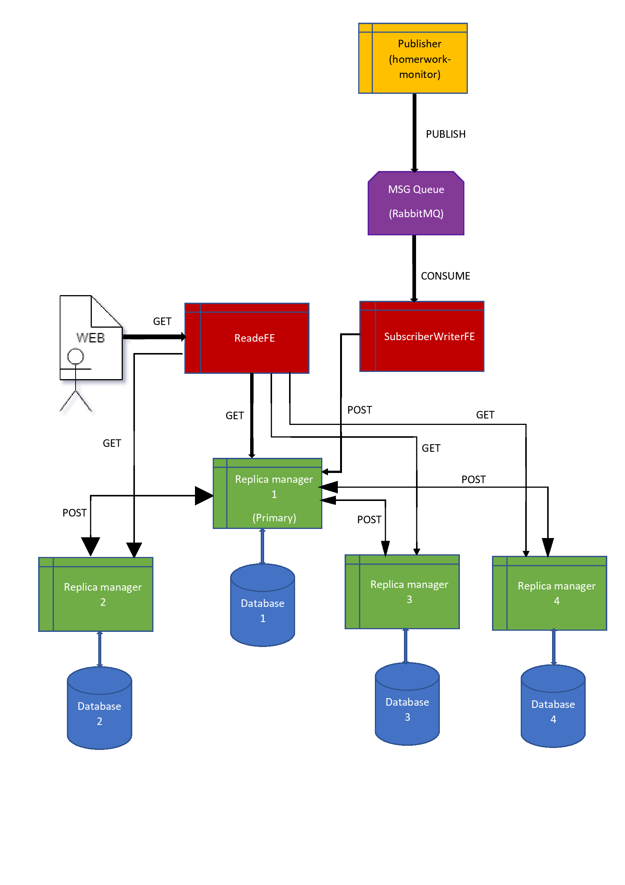

# SistemaPrimaryBackup
Procedure per l'avvio del SistemaPrimaryBackup:
1. Clonare o scaricare il repository all'url https://github.com/matteobonaccorso/SistemaPrimaryBackup
2. Entrare nella cartella "cartella_avvio" e digitare nel terminale "sudo ./BuildImages.sh" il comando costruirà le immagini necessarie, l'operazione richiede quindi una connessione internet stabile e alcuni minuti per il completamento
3. Sempre nella cartella corrente digitare "sudo docker-compose up" 
4. Mentre i container vengono creati si può avviare il progetto enterprise "homwork_monitor" con netbeans o in qualsiasi altro modo, questo progetto può essere avviato prima, durante o dopo l'istruzione 3
5. aspettare qualche minuto affinchè i container vengano creati e avviati
6. Nella pagina che si aprirà sul browser testare l'applicazione mediante le api messe a disposizione, se la pagina non viene aperta digitare sul browser "localhost:8086/ReaderFE/" e continuare
7. Per la documentazione completa andare nella cartella "docs" e consultare il pdf "Documentazione.pdf".

